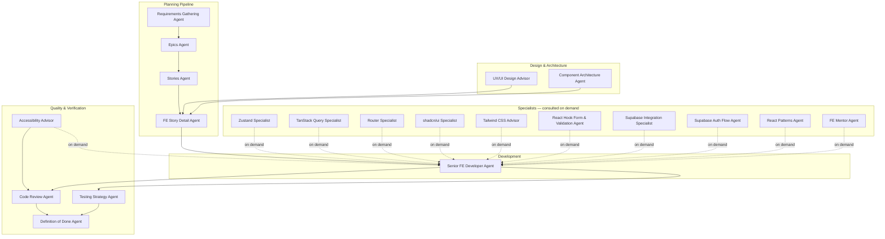

# Agent Workflow

This diagram shows how all agents relate to each other throughout the project lifecycle — from discovery through to a completed, verified story.

## Flow Overview



## Agent Groups Explained

### Planning Pipeline

Agents used in sequence at the start of any new feature or project phase. Each agent's output is the input to the next.

| Agent                        | Input                 | Output                         |
| ---------------------------- | --------------------- | ------------------------------ |
| Requirements Gathering Agent | User conversation     | Requirements document          |
| Epics Agent                  | Requirements document | Epics list                     |
| Stories Agent                | Epics list            | User stories                   |
| FE Story Detail Agent        | User stories          | Refined FE implementation plan |

### Design & Architecture

Consulted during refinement to shape the implementation plan before development starts.

| Agent                        | When to use                                                      |
| ---------------------------- | ---------------------------------------------------------------- |
| UX/UI Design Advisor         | When defining screen layouts, user flows or interaction patterns |
| Component Architecture Agent | When designing component structure for a new feature             |

### Development

The agent that implements the story based on the refined plan.

| Agent                     | When to use                            |
| ------------------------- | -------------------------------------- |
| Senior FE Developer Agent | When implementing a refined user story |

### Specialists — consulted on demand

Brought in during development whenever specific expertise is needed. Not part of the main sequence.

| Agent                              | When to use                                                  |
| ---------------------------------- | ------------------------------------------------------------ |
| Zustand Specialist                 | Designing or reviewing store structure                       |
| TanStack Query Specialist          | Designing or reviewing data fetching hooks                   |
| Router Specialist                  | Designing or reviewing routing and navigation                |
| shadcn/ui Specialist               | Choosing or customizing shadcn/ui components                 |
| Tailwind CSS Advisor               | Styling decisions, responsive design, theming                |
| React Hook Form & Validation Agent | Form design, Zod schemas, submission logic                   |
| Supabase Integration Specialist    | Database queries, realtime, storage                          |
| Supabase Auth Flow Agent           | Auth flows, session management, protected routes             |
| React Patterns Agent               | Choosing the right React pattern for a problem               |
| FE Mentor Agent                    | Learning concepts, getting unstuck, understanding trade-offs |

### Quality & Verification

Used after implementation to ensure the story meets quality standards before being marked done.

| Agent                    | When to use                                                 |
| ------------------------ | ----------------------------------------------------------- |
| Accessibility Advisor    | Reviewing a11y during development or as part of code review |
| Code Review Agent        | Reviewing completed implementation                          |
| Testing Strategy Agent   | Defining and reviewing tests                                |
| Definition of Done Agent | Final verification before marking a story as done           |

```

```
